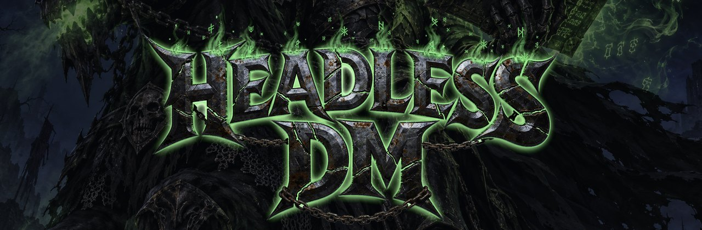

<p align="center">
  
</p>

# Headless DM

An **AzerothCore 3.3.5a** realm where hundreds of playerbots are voiced by language models as people who
live in Azeroth. They have written pasts and a trade, they remember what happened to them and how they feel
about everyone they have met, their companies hold land and lose it, and news of what they did travels the
roads and changes on the way.

Every word is generated on machines you own. There is no cloud service and no per-message bill.

The project site, with screenshots and transcripts: **https://bazola.github.io/headless-dm-page/**

## What is here

| Path | What |
|---|---|
| `docs/GUIDE.md` | The setup runbook — 13 phases, each with a gate and a check |
| `docs/EXTENDING.md` | How to build on it |
| `services/` | The Python services: lore, regard, chronicler, economy, router, memory |
| `ops/` | Bootstrap, build, systemd units, database and config tooling |
| `sql/` | Schema for our own tables, era overlays and world overlays |
| `conf/` | Changed config keys only, redacted |
| `site.example/` | Templates for the answers that are yours: `site.env`, `secrets.env`, `fleet.toml` |
| `src/` | The server and its modules, as submodules |

## Getting it

```sh
git clone --recursive https://github.com/bazola/headless-dm.git
cd headless-dm
cp site.example/site.env site/site.env      # then fill it in
```

Then follow `docs/GUIDE.md` from Part 0. It is written to be run by a coding agent alongside you: it stops
at every gate and asks rather than guessing.

## The shape of it

The world server never waits for slow thinking. Everything the realm does is recorded by `mod-ledger`; the
Python services read that record on their own timers and write rows; `mod-ollama-chat` reads those rows from
memory while building a prompt. No prompt assembly makes a database query or an HTTP call.

Two directories decide where things live:

- **`site/`** — this machine's answers. Never tracked. `SITE_DIR` can point it somewhere else entirely, which
  is what lets this tree stay generic while a private repo holds one realm's specifics.
- **`src/`** — the core and the modules, as submodules. The core is pinned upstream and is not forked here.
  Modules are symlinked into the core by `ops/bootstrap.sh`, because AzerothCore only looks in
  `${CMAKE_SOURCE_DIR}/modules` and git cannot nest a submodule inside another submodule's tree.

## Rules this repository keeps

- **No Blizzard-derived data, ever.** No client files, no extracted maps or art, no world database dumps.
- **No core diffs.** Every change to a public module is a commit on that fork's own branch, off by default.
- **Secrets live only in `site/secrets.env`**, which is never tracked.

## Licence

MIT — see `LICENSE`, and `NOTICE` for the components this builds on.

World of Warcraft and Warcraft are trademarks of Blizzard Entertainment. This project is not affiliated with
or endorsed by Blizzard, and distributes no Blizzard data.
